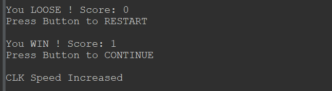

# STM32 Based Handheld Brick Breaker Game
***Note: This is an undergraduate coursework. Permission is obtained from the module lead to upload the project files to GitHub.***

## Introduction
This is a simple brick breaker game, made up of:
- STM32 NUCLEO-F401RE board
- joystick
- [PIMORONI 11x7 LED Matrix Breakout](https://shop.pimoroni.com/products/11x7-led-matrix-breakout?variant=21791690752083) (Powered by an IS31FL3731 driver chip).

***Overview:***

## Gameplay

***Game Fail:***\

***Score and Other Info:***\
Via UART2 (STLink USB) at baud rate 115200, 8 bits data, no parity, 1 stop bit\
\
Clock speed of the game main can be viewed via the on board LED (**LD2**, Green)

## Basic Controls
| Function | Control |
| --- | --- |
| Start / Pause Game | SHORT CLICK Pushbutton |
| Left Shift Paddle | Joystick LEFT |
| Right Shift Paddle | Joystick RIGHT |
| Increase Game Clock Speed (Bonus + 1) | Joystick UP |
| Decrease Game Clock Speed (Bonus - 1) | Joystick DOWN |
| Engage (Disengage) Autoplay | Long PRESS Pushbutton |

## Game Rules
Initial Bonus = 1\
**WIN** -> All blocks cleared.\
- *Score = Score + Bonus*
- Game main clock speed increase once, *Bonus = 1*
**LOSE** -> Ball fall off from the bottom line
- You lose all the scores\
**Difficulty Adjustment** -> Joystick UP / DOWN
- Increase clock speed: *Bonus ++*
- Decrease clock speed: *Bonus --*